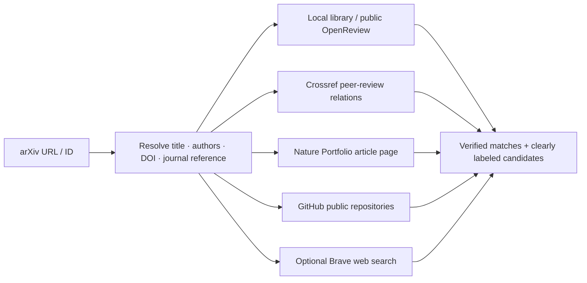
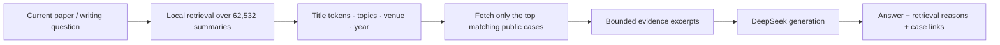
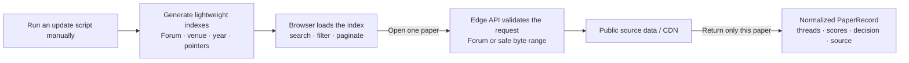

<div align="right">

**English** · [简体中文](./README.zh-CN.md)

</div>

<div align="center">

# Rebuttal Reader · 答辩录

### Don’t stop at what a paper became. Read how it answered scrutiny.

Reconstructing scattered **Review → Author Response → Reviewer Follow-up → Meta-review → Decision** records<br />
into a coherent trail of arguments, evidence, and outcomes.

[**Explore the live reader ↗**](https://rebuttal-reader-functionhx.functionhx.chatgpt.site)　·　[**Submit your rebuttal ↗**](https://github.com/Functionhx/rebuttal-reader/issues/new?template=submit-rebuttal.yml)　·　[Data landscape](#data-landscape)　·　[Run locally](#run-locally)

</div>

<a href="https://rebuttal-reader-functionhx.functionhx.chatgpt.site">
  
</a>

<br />

<div align="center">

| **62,532** | **286,659** | **2018–2026** | **On demand** |
|:---:|:---:|:---:|:---:|
| deduplicated public cases | reviewer threads | years currently indexed | one paper loaded at a time |

</div>

> [!NOTE]
> **Public Beta.** These figures come from the latest lightweight indexes generated in this repository. Updates are triggered manually. Because sources overlap, the live total is deduplicated by Forum ID rather than calculated by adding the source counts below.

## The final PDF is only half the story

OpenReview preserves rich peer-review conversations, but they are often scattered across nested Notes and Comments. Research datasets make those conversations analyzable, but rarely pleasant to read. Journal response letters are frequently locked inside long PDFs that are difficult to navigate or compare.

Rebuttal Reader restores the missing context around a submission:

```text
What was the reviewer’s central concern?
                    ↓
How did the authors clarify, counter, or add evidence?
                    ↓
Did the reviewer follow up or change their position?
                    ↓
How did the scores move?
                    ↓
How did the meta-review weigh the dispute—and why was the paper accepted or rejected?
```

The result is not a folder of rebuttal files. It is an **evidence trail from scrutiny to decision**.

## Read a rebuttal as an argument, not an attachment

- **A causal thread for every reviewer** — initial review, author response, and follow-up discussion remain in the same conversational context.
- **Author-response view** — collect every Author Response in one place to study structure, tone, and evidence.
- **Decision and meta-review view** — inspect score records, the final outcome, and the area chair’s or editor’s reasoning separately.
- **A searchable case library** — filter by title, topic, venue, year, or Forum ID.
- **Honest score timelines** — distinguish initial and final ratings; values absent from the source stay absent.
- **Traceable provenance** — every case retains its source type, original Forum, license information, and known data boundaries.
- **Shareable case URLs** — the selected paper is encoded in the URL, so a copied link opens the same reading position.
- **A lightweight first load** — the browser receives an index first; review and response bodies load only after a paper is opened.

## Paste an arXiv link · Discover the public review trail

Already have a paper in mind? Paste an arXiv URL or ID—such as
`https://arxiv.org/abs/2501.01234`, `https://arxiv.org/pdf/2501.01234`, or
`2501.01234`—and Rebuttal Reader performs an **on-demand, cross-source
discovery pass** for that paper:



The discovery route deliberately combines several different kinds of evidence:

- **Local index and OpenReview** — compare the resolved paper metadata with the
  public cases already indexed by Rebuttal Reader and retain canonical Forum
  links.
- **Crossref** — inspect the published DOI and any registered peer-review
  records or `is-review-of` relationships, including author comments and
  referee reports when publishers deposit them.
- **Nature Portfolio, including subjournals** — when the published DOI begins
  with `10.1038/`, inspect that paper’s actual `nature.com` article page for a
  real **Transparent Peer Review** or **Peer Review File** attachment. Coverage
  follows the DOI and canonical page instead of a brittle journal-name
  whitelist, so Nature, Nature Communications, Communications journals, and
  other participating subjournals can be discovered through the same path.
- **GitHub** — inspect public repository metadata and, when a server-side token
  is configured, use authenticated code search for files such as
  `rebuttal.pdf`, `author_response.md`, or `response_to_reviewers.pdf`.
- **Brave Search, optional** — broaden discovery to public project pages,
  institutional sites, and other indexed pages that mention the resolved paper
  and a rebuttal or response letter.

This is a **discovery tool, not an always-on crawler**. Nature peer-review PDFs
are linked from their canonical publisher page and are not mirrored into this
repository. GitHub and web-search results are labeled as candidates until their
paper identity and publication rights can be verified. Likewise, “not found”
means only that the currently queried public sources did not return a reliable
match—it does **not** prove that no rebuttal exists.

### Optional discovery credentials

Basic discovery still works without private credentials: arXiv metadata,
the local/OpenReview index, Crossref, and eligible Nature Portfolio pages can
all be checked on demand. Optional server-only credentials improve GitHub
coverage and enable broader web search:

```bash
# Optional: authenticated GitHub code search with a read-only token
export GITHUB_TOKEN="your-read-only-token-here"

# Optional: public-web discovery through Brave Search
export BRAVE_SEARCH_API_KEY="your-brave-search-api-key-here"

npm run dev
```

These values must remain server-side: never commit them, place them in browser
storage, or expose them through a `NEXT_PUBLIC_` variable. A public deployment
without either value remains useful; it simply reports GitHub code search or
Brave Search as unavailable while returning results from the sources it can
query safely.

Thank you to arXiv for use of its open access interoperability. Rebuttal Reader
uses metadata supplied through the arXiv API; arXiv records remain canonical at
arXiv, and use of the metadata does not imply endorsement by arXiv or Cornell
University.

## Optional DeepSeek assistant · Explainable RAG

Rebuttal Reader includes an optional local AI assistant for three focused tasks:

1. **Understand this rebuttal** — identify the reviewer’s central concern, the response strategy, the evidence used, and what remained unresolved;
2. **Find similar cases** — retrieve related public rebuttals from the local index and explain the observable matching signals;
3. **Improve a response draft** — suggest structure, tone, and missing reasoning without inventing experiments, results, citations, or venue policies.

The first version uses a lightweight, inspectable RAG pipeline rather than a hidden vector database:



Similarity is presented as evidence, not as an opaque confidence score. Every retrieved case keeps a Rebuttal Reader link and its canonical Forum URL, and the assistant is explicitly instructed to acknowledge uncertainty and never fabricate missing evidence.

### Enable DeepSeek locally

The API key is read only by the server process. It is never placed in browser state, source code, Git history, generated indexes, or deployment assets.

```bash
export DEEPSEEK_API_KEY="your-key-here"
# Optional; defaults to the current low-latency model:
export DEEPSEEK_MODEL="deepseek-v4-flash"
npm run dev
```

The public deployment deliberately ships without a maintainer API key. Metadata retrieval and similar-case discovery remain available, while model generation stays disabled. Do not enable public model access without adding authentication, quotas, and rate limiting. The adapter follows the official [DeepSeek Chat Completions API](https://api-docs.deepseek.com/api/create-chat-completion/).

## Submit your rebuttal · Help build a public learning commons

> [!TIP]
> **A carefully written rebuttal should not disappear when the submission portal closes.**<br />
> If you are willing to share yours, we welcome cases that were **Accepted, Rejected, Withdrawn, or still under discussion**. A calm, rigorous response to an unsuccessful submission can be every bit as instructive as a celebrated turnaround.

<div align="center">

[**Submit your rebuttal ↗**](https://github.com/Functionhx/rebuttal-reader/issues/new?template=submit-rebuttal.yml)　·　[Contribute an adapter or feature ↗](https://github.com/Functionhx/rebuttal-reader/compare)

</div>

We currently welcome three distinct kinds of material:

1. **Conference rebuttal** — an author response submitted before the final decision;
2. **Response to reviewers** — a point-by-point letter accompanying a journal revision;
3. **Public discussion** — an open, multi-round conversation among authors, reviewers, area chairs, or editors.

The [submission issue form](https://github.com/Functionhx/rebuttal-reader/issues/new?template=submit-rebuttal.yml) asks for the paper title, venue and year, DOI / arXiv / Forum link, material type, public source, and optional outcome. You can point us to an already public OpenReview Forum, an author-maintained repository or project page, or material you own and have the right to publish in PDF or Markdown form.

To protect authors and reviewers, submitters must confirm that:

- they are an author or rights holder, or the material is already public through a trustworthy source;
- reviewer identities, email addresses, and confidential comments that should not be disclosed have been removed;
- publication is consistent with the relevant venue, journal, and review-platform policies;
- the project may index and format the material, while honoring legitimate correction or removal requests.

Cannot share the full reviews? That is fine. You may submit only the rebuttal you have the right to publish and state which surrounding context may be shown. This project is not a scoreboard, and it does not curate only “successful” rebuttals. The goal is to build a community library of real responses that future authors can inspect, compare, and learn from.

## Data landscape

Rebuttal Reader normalizes several **public sources** into one `PaperRecord` model and deduplicates records by Forum ID. The figures below describe each source’s own index and therefore must not be added together:

| Source | Current index | Primary coverage | Access pattern |
|---|---:|---|---|
| [ReviewRebuttal / Re²](https://huggingface.co/datasets/Daoze/ReviewRebuttal) | 14,830 papers · 53,818 threads | 45 earlier OpenReview venues | local lightweight index + safe remote byte ranges |
| [OpenReview Raw public archive](https://huggingface.co/datasets/Jasonpicky/openreview_raw) | 35,151 papers · 182,783 threads | public Notes from 2018–2025 | year-sharded indexes + remote filtered queries |
| [ReviewBench](https://huggingface.co/datasets/Samarth0710/reviewbench) | 5,536 papers · 19,889 threads | NeurIPS, ICLR, ICML, TMLR, EMNLP, CoRL, and COLM | remote Parquet row lookup |
| [ICLR public archive](https://huggingface.co/datasets/MlouisBE/iclr-rebuttal-analysis) | 14,708 papers · 57,267 threads | public ICLR 2026 discussions | exact remote JSON byte ranges |
| [OpenReview API](https://openreview.net/) | manual increments | selected Forums or registry venues | per-paper storage after a public-access check |

### Why do some records show a reviewer subject or Forum ID instead of a paper title?

Not every derived dataset preserves the complete metadata of the original submission Note. Some records contain only:

- the OpenReview Forum ID;
- the subject line written for a review;
- the review, Author Response, scores, and discussion fields.

Rebuttal Reader always prefers a verified paper title. When paper metadata is available in the per-paper payload, the title, authors, and abstract are restored after the case loads. If the upstream source truly omitted the title, `titleKind` marks that limitation explicitly and the interface falls back to the reviewer subject or Forum ID.

The project deliberately **does not invent a paper title from review text**. A visibly incomplete identifier is more honest—and less misleading—than a confident but incorrect title.

## The data is not bundled into the webpage

The deployment does not ship a 896 MB OpenReview Raw Parquet file, the 1.36 GB ICLR 2026 source JSON, every paper PDF, or a full-text OCR archive.



Historical indexes are sharded by year. The complete current index is about **57.4 MB** uncompressed, approximately **6.3 MB** gzipped, with every individual shard below **9 MB**. Full discussion bodies are fetched on demand from source hosts and CDNs, then cached. The local `.cache/` directory exists only for index generation; it is neither committed nor deployed and can be regenerated after deletion.

## Public access and privacy boundaries

The project follows one rule: **only publicly verifiable material enters the index; missing data remains missing.**

- The incremental OpenReview adapter checks every Note for a `readers` entry containing `everyone`; private Notes are skipped.
- It never bypasses authentication or reads review material from closed CMT, HotCRP, PaperPlaza, or similar workflows.
- A venue’s use of OpenReview is never treated as proof that its reviews are public.
- Paper PDFs are not mirrored. Comments, responses, and metadata retain separate source and license information.
- Missing scores, meta-reviews, author details, and paper titles are never guessed.
- Derived datasets and canonical OpenReview sources are labeled separately in the interface.
- Credentials used for updates are read temporarily from local environment variables and must never be written to the repository.

## Run locally

Requires **Node.js 22.13+**.

```bash
git clone https://github.com/Functionhx/rebuttal-reader.git
cd rebuttal-reader
npm ci
npm run dev
```

Open the local URL printed in the terminal. Run the complete verification suite with:

```bash
npm test
```

The tests cover the site build, essential rendered structure, public-access gates, index boundaries, and normalized `Review → Author Response → Reviewer Follow-up` sequences.

## Update the data manually

There is no always-on crawler. The maintainer decides when to read public sources, rebuild the indexes, and redeploy.

### Refresh every public index

```bash
npm run update:data
```

On its first run, the Re² updater downloads roughly 1 GB of public source JSON and reuses that local cache thereafter. Other adapters build lightweight indexes through remote Parquet column reads or sequential byte scans without writing the complete datasets into the project.

### Update one source at a time

```bash
# ReviewBench multi-venue public archive
npm run update:reviewbench

# OpenReview Raw historical public index
npm run update:openreview-archive

# ICLR 2026 public discussions
npm run update:iclr-archive

# Resume an interrupted large-file scan
npm run update:iclr-archive -- --resume
```

### Import incrementally from OpenReview

```bash
# One public Forum
npm run update:openreview -- --forum 7QfLW-XZTl

# Every public Forum under a venue
npm run update:openreview -- --venue ICLR.cc/2026/Conference

# Every venue configured in config/venues.json
npm run update:openreview -- --all
```

OpenReview’s batch API may require a verified session. The updater can read a local `OPENREVIEW_TOKEN`, or temporarily use `OPENREVIEW_USERNAME` / `OPENREVIEW_PASSWORD` to obtain a short-lived token. These credentials are used only for maintainer-triggered updates. **Visitors do not need an OpenReview, GitHub, or ChatGPT account.**

## Project structure

```text
app/
├── reader-app.tsx                 # search, reader, and thread interaction
├── ai-assistant.tsx               # explainable RAG and DeepSeek drawer
├── discovery-dialog.tsx           # arXiv cross-source discovery interface
└── api/
    ├── assistant/                  # local-only DeepSeek adapter
    ├── discovery/                  # arXiv, Crossref, Nature, GitHub, and web discovery
    ├── re2/                       # safe Re² byte-range reads
    ├── reviewbench/               # Parquet row lookup and normalization
    ├── openreview-archive/        # filtered reads from public Notes
    └── iclr-archive/              # ICLR JSON range reads

public/data/
├── re2/index.json                 # lightweight Re² index
├── reviewbench/index.json         # multi-venue row pointers
├── openreview-archive/            # year-sharded Forum indexes
├── iclr-archive/index.json        # exact JSON byte pointers
└── openreview/                    # incremental OpenReview indexes and case details

scripts/
├── update-re2.mjs
├── update-reviewbench.mjs
├── update-openreview-archive.mjs
├── update-iclr-archive.mjs
└── update-openreview.mjs

config/venues.json                 # invitation registry for different venues
lib/
├── discovery.ts                   # validation, matching, and source discovery helpers
├── rag.ts                         # deterministic retrieval and evidence bounds
└── types.ts                       # normalized model and source types
tests/                             # build, API safety, retrieval, and normalization tests
```

The core model retains paper metadata, reviewer threads, round-by-round messages, scores before and after discussion, meta-review, decision, source, license, and provenance. It keeps three material types distinct:

1. `conference_rebuttal` — an author response submitted before a conference decision;
2. `response_to_reviewers` — a point-by-point response accompanying a journal revision;
3. `public_discussion` — a public multi-round discussion among authors, reviewers, and area chairs.

## Deployment, backup, and portability

The current production build runs at:

**[rebuttal-reader-functionhx.functionhx.chatgpt.site ↗](https://rebuttal-reader-functionhx.functionhx.chatgpt.site)**

This GitHub repository is the independent, recoverable copy: it contains the complete source, lightweight indexes, update scripts, and build configuration. Dependencies, generated build output, `.cache/`, environment variables, and credentials are not committed.

The current artifact is a vinext application compatible with Cloudflare Workers and does not depend on D1 or R2. If the present hosting URL becomes unavailable, the repository can be connected to another platform that supports server-side functions or Edge Workers, built with `npm run build`, and placed behind a custom domain.

> [!IMPORTANT]
> GitHub Pages can host static files only; it cannot run the server-side API routes used by this project. The repository is a complete backup, but a fallback deployment still needs an environment with server-side functions.

## Design principles

Rebuttal Reader treats public peer review as a body of writing worth reading carefully. The interface deliberately avoids declaring who “won.” It is designed to help readers answer three more useful questions:

1. Was the criticism understood accurately?
2. What evidence did the response provide?
3. How did the discussion shape the final judgment?

If this project can make one rebuttal less frantic and more structured, it has done something worthwhile.

---

<div align="center">

**Public peer review, reconstructed.**

[Start reading](https://rebuttal-reader-functionhx.functionhx.chatgpt.site) · [Submit your rebuttal](https://github.com/Functionhx/rebuttal-reader/issues/new?template=submit-rebuttal.yml) · [Update the data](#update-the-data-manually) · [Back to top](#rebuttal-reader--答辩录)

</div>
