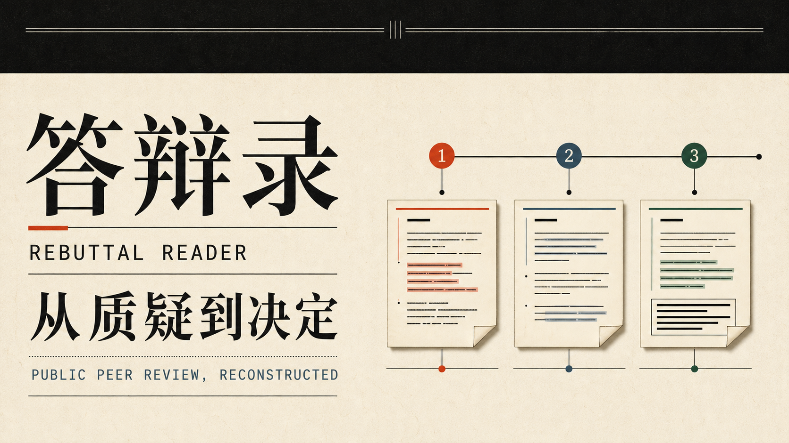
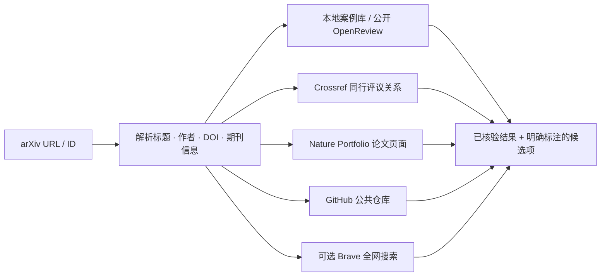
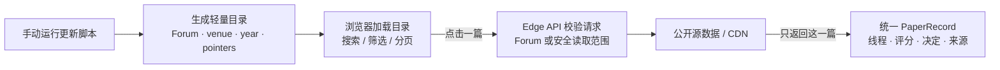

<div align="center">

[**English**](./README.md)　|　**简体中文**

# 答辩录 · Rebuttal Reader

### 别只看论文最后写成了什么，也看它如何回应质疑。

把散落的 **Review → Author Response → Reviewer Follow-up → Meta-review → Decision**<br />
重新组织成一条可以阅读、比较与学习的因果链。

[**打开在线版 ↗**](https://rebuttal-reader-functionhx.functionhx.chatgpt.site)　·　[**提交你的 Rebuttal ↗**](https://github.com/Functionhx/rebuttal-reader/issues/new?template=submit-rebuttal-zh.yml)　·　[数据版图](#数据版图)　·　[本地运行](#本地运行)

</div>

<a href="https://rebuttal-reader-functionhx.functionhx.chatgpt.site">
  
</a>

<br />

<div align="center">

| **129,438** | **273,008** | **2015–2026** | **按需读取** |
|:---:|:---:|:---:|:---:|
| 公开索引记录 | 已结构化 Reviewer 线程 | 当前索引年份 | 点开一篇，才解析一篇或一个文件 |

</div>

> [!NOTE]
> **Public Beta.** 当前数字来自仓库内最新生成的轻量索引，数据采用手动触发更新。
> OpenReview 记录按 Forum ID 去重；Nature 记录使用 PMCID。若同一项研究也经历过会议投稿，
> 它会作为独立的期刊同行评议档案保留。

## 它解决什么问题

OpenReview 里信息很完整，却经常分散在多层 Note 和 Comment 中；公开数据集适合研究，却不适合像读文章一样浏览；PDF 形式的 response letter 又很难横向比较。

答辩录不只是“收集 rebuttal”，而是恢复一篇投稿经历的上下文：

```text
Reviewer 提出了什么关键质疑？
               ↓
作者如何逐点回应、澄清或补充实验？
               ↓
Reviewer 是否继续追问，态度是否改变？
               ↓
评分发生了什么变化？
               ↓
Meta-review 如何权衡争议，最终为何接受或拒绝？
```

最终呈现的不是一堆孤立文档，而是一条**从质疑到决定的证据链**。

## 一眼读懂一场 Rebuttal

- **逐 Reviewer 因果链**：把每位 Reviewer 的初评、作者回复和后续追问放回同一线程。
- **只看作者回复**：汇总全部 Author Response，快速学习回复结构与表达方式。
- **决定与 Meta-review**：单独查看评分记录、最终决定及领域主席的判断依据。
- **可搜索的案例库**：按标题、主题、会议、年份或 Forum ID 检索与筛选。
- **可浏览的 Nature Portfolio 目录**：按标题、期刊、年份、DOI 或 PMCID
  检索透明同行评议记录，再按需打开经过核验的官方文件，不镜像 PDF。
- **评分变化可视化**：区分初评和终评；源数据没有保存的值明确标为缺失，不做猜测。
- **完整来源说明**：每篇保留原始 Forum、来源类型、许可与数据边界。
- **分享单篇案例**：选中的论文写入 URL，可复制链接直接抵达同一阅读位置。
- **轻量首屏**：浏览器先加载目录；Review 与回复正文只在点开论文后读取。

## 粘贴 arXiv 链接 · 跨来源寻找公开 Rebuttal

如果你已经有一篇想查的论文，可以直接粘贴 arXiv URL 或 ID，例如
`https://arxiv.org/abs/2501.01234`、`https://arxiv.org/pdf/2501.01234`
或 `2501.01234`。答辩录会针对这篇论文发起一次**按需、跨来源的发现流程**：



发现流程会组合几类性质不同、但都可以回到原始来源核对的证据：

- **本地索引与 OpenReview**：把 arXiv 返回的论文元数据与答辩录已经收录的公开案例进行匹配，并保留 canonical Forum 链接。
- **Crossref**：检查论文发表 DOI，以及出版社登记的 peer-review 记录与
  `is-review-of` 关系；若来源提供 Author Comment 或 Referee Report，也会一并展示。
- **Nature Portfolio 及其子刊**：先与通过
  [Europe PMC REST API](https://europepmc.org/RestfulWebService) 生成的本地
  Nature 目录进行匹配；当发表 DOI 以 `10.1038/` 开头时，按需发现流程还可检查
  canonical 出版社页面是否挂有 **Transparent Peer Review** 或
  **Peer Review File** 附件。
- **GitHub**：检查公共仓库元数据；若服务端配置了 Token，再使用经过认证的代码搜索寻找
  `rebuttal.pdf`、`author_response.md`、`response_to_reviewers.pdf` 等候选文件。
- **Brave Search（可选）**：把发现范围扩展到公开项目主页、机构网站及其他同时提到论文和
  rebuttal / response letter 的已索引页面。

它是一个**元数据索引与按需发现工具，不是后台常驻爬虫**。Nature 记录现在会直接进入左侧
案例库及期刊 / 年份筛选；同行评议 PDF 仍保留在 Europe PMC 或出版社，只有读者点开某条记录后
才会定位。GitHub 与网页搜索命中项在论文身份和公开权利得到核验前，都会明确标成“候选”。
同样，“没有找到”只表示本次查询的公开来源没有返回可靠匹配，**不代表这篇论文一定不存在
Rebuttal**。

Nature 的透明同行评议文件可能把 Decision Letter、Reviewer Report、作者 Rebuttal
以及多轮修改合并在同一个 PDF 中。在文档尚未完成角色识别和轮次切分时，答辩录只把它展示为
一份公开档案文件，不会臆造站内对话时间线。

### 可选的发现服务凭据

即使没有任何私有凭据，基础发现仍然可用：arXiv 元数据、本地 / OpenReview 索引、Crossref，
以及符合条件的 Nature Portfolio 页面都可以按需检查。下面两个仅由服务端读取的可选变量，
分别用于提升 GitHub 覆盖率和启用更广的网页搜索：

```bash
# 可选：使用只读 Token 进行 GitHub 认证代码搜索
export GITHUB_TOKEN="your-read-only-token-here"

# 可选：通过 Brave Search 发现公开网页
export BRAVE_SEARCH_API_KEY="your-brave-search-api-key-here"

npm run dev
```

这些值必须留在服务端：不要提交到 Git，不要写入浏览器存储，也不要通过 `NEXT_PUBLIC_`
变量暴露。公开部署即使没有这两个变量也能工作；它只会把 GitHub 代码搜索或 Brave Search
标记为不可用，并继续返回其他来源能够安全取得的结果。

答辩录通过 arXiv API 使用论文元数据：*Thank you to arXiv for use of its open
access interoperability.* arXiv 上的记录仍以 arXiv 为 canonical source；使用这些
元数据不代表 arXiv 或 Cornell University 对本项目提供背书。

## 可选 DeepSeek 助读 · 可解释 RAG

答辩录提供一个可选的本地 AI 助手，专注于三件事：

1. **读懂本篇**：提炼 Reviewer 的核心质疑、作者的回应策略、使用的证据和仍未解决的问题；
2. **寻找相似案例**：从本地索引召回相关的公开 Rebuttal，并解释可以观察到的匹配依据；
3. **打磨回复草稿**：改善结构、语气和论证缺口，但绝不虚构实验、结果、引用或会议政策。

第一版采用轻量、可检查的 RAG 流程，而不是不可见的向量数据库：


相似性会作为可以核对的依据展示，而不是一个不透明的“置信分”。每条召回案例都保留答辩录站内链接和原始 Forum；助手也被明确要求承认不确定性，不能补写不存在的证据。

### 在本地启用 DeepSeek

API 密钥只由服务端进程读取，不会进入浏览器状态、源码、Git 历史、生成索引或部署产物。

```bash
export DEEPSEEK_API_KEY="your-key-here"
# 可选；默认使用当前低延迟模型：
export DEEPSEEK_MODEL="deepseek-v4-flash"
npm run dev
```

公开部署刻意不携带站长的 API 密钥：元数据召回和相似案例发现仍然可用，模型生成则保持关闭。若未来开放公共模型调用，应先加入身份验证、额度和限流。适配器遵循官方 [DeepSeek Chat Completions API](https://api-docs.deepseek.com/api/create-chat-completion/)。

## 提交你的 Rebuttal · 一起搭建社区

> [!TIP]
> **一份认真写过的 Rebuttal，不应该在投稿系统关闭后就消失。**<br />
> 如果你愿意公开自己的回复，无论论文最终是 **Accepted、Rejected、Withdrawn**
> 还是仍在讨论中，都欢迎把它留在这里，成为下一位作者可以检索、阅读和学习的真实案例。

<div align="center">

[**提交一篇 Rebuttal ↗**](https://github.com/Functionhx/rebuttal-reader/issues/new?template=submit-rebuttal-zh.yml)　·　[提交数据适配器或功能 PR ↗](https://github.com/Functionhx/rebuttal-reader/compare)

</div>

目前欢迎三类材料：

1. **Conference rebuttal** — 最终决定前提交的作者回复；
2. **Response to reviewers** — 期刊修改稿的逐点回复信；
3. **Public discussion** — 作者、Reviewer、AC 或 Editor 的公开多轮讨论。

提交时请提供论文标题、会议或期刊与年份、DOI / arXiv / Forum
链接、材料类型、公开来源及可选的最终结果。可以提交已经公开的 OpenReview
Forum、作者本人维护的 GitHub / 项目页面，也可以在确认拥有公开权利后提交自己的
PDF 或 Markdown。项目会保留来源和许可信息，并把不同材料类型分开呈现。

为了保护作者与 Reviewer，提交者需要确认：

- 自己是作者、权利人，或材料已经由可信来源公开；
- 已移除不应公开的 Reviewer 身份、邮箱及机密评论；
- 公开行为符合会议、期刊与投稿系统政策；
- 接受项目对材料进行索引、格式化展示，并可响应权利人的更正或删除请求。

不方便公开完整 Review 也没关系：可以只提交作者拥有权利的 Rebuttal，并注明哪些上下文可以展示。这里不评判论文输赢，也不只收藏“成功翻盘”——**被拒稿后依然清晰、克制、有证据的回复，同样值得学习。**

## 数据版图

答辩录把多个**公开来源**规范化成统一的 `PaperRecord`，再按 Forum ID 去重。下面的数量是各来源自身的索引规模，因此不能直接相加：

| 数据源 | 当前索引 | 主要覆盖 | 读取方式 |
|---|---:|---|---|
| [ReviewRebuttal / Re²](https://huggingface.co/datasets/Daoze/ReviewRebuttal) | 14,830 篇 · 53,818 线程 | 45 个较早期 OpenReview venue | 本地轻量索引 + 远程安全字节范围 |
| [OpenReview Raw public archive](https://huggingface.co/datasets/Jasonpicky/openreview_raw) | 35,151 篇 · 182,783 线程 | 2018–2025 公共 Note | 按年份分片目录 + 远程过滤查询 |
| [ReviewBench](https://huggingface.co/datasets/Samarth0710/reviewbench) | 5,536 篇 · 19,889 线程 | NeurIPS、ICLR、ICML、TMLR、EMNLP、CoRL、COLM | 远程 Parquet 行定位 |
| [ICLR public archive](https://huggingface.co/datasets/MlouisBE/iclr-rebuttal-analysis) | 14,708 篇 · 57,267 线程 | ICLR 2026 公共讨论 | 远程 JSON 精确字节范围 |
| [OpenReview API](https://openreview.net/) | 手动增量 | 指定 Forum 或 registry venue | 公开权限检查后按篇保存 |
| [Europe PMC](https://europepmc.org/RestfulWebService) · Nature Portfolio | 66,906 条 · 0 条伪造线程 | 11 本已配置期刊，2015–2026 | 按年份切分元数据，点击后定位官方同行评议文件 |

### 为什么有时显示 Reviewer 的主题标题或 Forum ID？

并不是所有派生数据集都保存了投稿 Note 的完整元数据。部分记录只有：

- OpenReview Forum ID；
- Reviewer 给这条 Review 写的主题标题；
- Review、Author Response 与评分等对话字段。

答辩录会优先使用真实论文标题；如果单篇详情中能够取得论文元数据，页面会在加载后补回标题、作者与摘要。若上游数据确实没有保存标题，则通过 `titleKind` 明确标记，并退回 Reviewer 主题标题或 Forum ID。项目刻意**不根据正文臆造论文标题**，因为一个醒目的错误标题比一个诚实的标识符更具误导性。

## 数据没有被“塞进网页”

部署包不会携带 896 MB 的 OpenReview Raw Parquet、1.36 GB 的 ICLR 2026 原始 JSON，也不会下载全部论文 PDF 或进行全文 OCR。



历史目录与 Nature 目录都按年份分片。Nature 分片只保存标题、期刊、年份、DOI、PMCID、
来源和远程文件指针等元数据，绝不保存同行评议 PDF。完整讨论正文与期刊文件都在点开单篇后，
从公开源站按需读取或定位；`.cache/` 只服务于本地生成流程，不提交、不部署，删除后可重新生成。

当前 Nature 目录约 **73 MiB 原始 JSON / 10.8 MB gzip**，分成 14 个文件，
每个分片均小于 **10 MiB**；全部公开目录合计约 **131 MiB 原始 JSON / 17.1 MB gzip**。
前端采用有限并发逐片合并，因此某个年份较慢时，已经加载的目录仍可先行浏览。

## 公开性与数据边界

这个项目的原则很简单：**能公开验证的才进入索引，缺失的就保持缺失。**

- OpenReview 增量适配器逐条检查 `readers` 是否包含 `everyone`；私有 Note 直接跳过。
- 不绕过登录，不读取 CMT、HotCRP、PaperPlaza 等封闭系统中的审稿材料。
- 不把“会议使用 OpenReview”误判为“该会议公开评审”。
- 不镜像论文 PDF；评论、回复与元数据分别保留原始来源和许可说明。
- Europe PMC 记录遵循每篇文章各自的开放许可；索引仅保存书目元数据，Nature
  合并同行评议 PDF 始终留在官方来源。
- 不猜测缺失评分、Meta-review、作者信息或论文标题。
- 派生数据与 OpenReview 原始来源在界面中分别标识，便于回到 canonical source 核验。
- 更新所需凭据只从本地环境变量临时读取，永远不应写入仓库。

## 本地运行

需要 **Node.js 22.13+**。

```bash
git clone https://github.com/Functionhx/rebuttal-reader.git
cd rebuttal-reader
npm ci
npm run dev
```

打开终端显示的本地地址。完整验证使用：

```bash
npm test
```

测试覆盖站点构建、页面关键结构、公开权限闸门、索引边界，以及 `Review → Author Response → Reviewer Follow-up` 的归一化结果。

## 手动更新数据

项目没有后台常驻爬虫。站长决定什么时候读取公开来源、生成新索引并重新部署。

### 刷新全部公开目录

```bash
npm run update:data
```

Re² 首次运行会下载约 1 GB 的公开原始 JSON，并在之后复用本地缓存；其他适配器通过远程 Parquet 列读取或顺序字节扫描生成轻量目录，不会把完整数据集写入项目。

### 分来源更新

```bash
# ReviewBench 多会议公开归档
npm run update:reviewbench

# OpenReview Raw 历史公共目录
npm run update:openreview-archive

# ICLR 2026 公共讨论
npm run update:iclr-archive

# Europe PMC / Nature Portfolio 元数据目录
npm run update:nature

# 重新构建已配置期刊的全部年份，而不是默认增量刷新
npm run update:nature -- --full --all-years

# 大文件扫描中断后，从断点继续
npm run update:iclr-archive -- --resume
```

Nature 更新器通过 Europe PMC cursor 分页，只生成有大小边界的年份元数据分片，
不会下载 PDF 或论文正文。完成一次全量构建后，普通的 `npm run update:nature`
会自动切换为增量模式，并以 Europe PMC 全文入库时间保留 45 天重叠窗口；
这样既能补到延迟入库的记录，也不会在刷新时丢掉原有的全年份覆盖。

### 从 OpenReview 增量导入

```bash
# 单个公开 Forum
npm run update:openreview -- --forum 7QfLW-XZTl

# 一个 venue 下的全部公开 Forum
npm run update:openreview -- --venue ICLR.cc/2026/Conference

# 扫描 config/venues.json 中配置的 venue
npm run update:openreview -- --all
```

OpenReview 批量接口可能要求已验证会话。更新脚本可读取本地 `OPENREVIEW_TOKEN`，或临时使用 `OPENREVIEW_USERNAME` / `OPENREVIEW_PASSWORD` 取得短期 token。凭据只用于站长的手动更新；**网站访客不需要 OpenReview、GitHub 或 ChatGPT 登录。**

## 项目结构

```text
app/
├── reader-app.tsx                 # 搜索、阅读器与线程交互
├── ai-assistant.tsx               # 可解释 RAG 与 DeepSeek 抽屉
├── discovery-dialog.tsx           # arXiv 跨来源发现界面
└── api/
    ├── assistant/                  # 仅限本地的 DeepSeek 适配器
    ├── discovery/                  # arXiv、Crossref、Nature、GitHub 与网页发现
    ├── nature/                     # Europe PMC 同行评议文件安全定位
    ├── re2/                       # Re² 安全字节范围读取
    ├── reviewbench/               # Parquet 单行读取与规范化
    ├── openreview-archive/        # 公共 Note 过滤读取
    └── iclr-archive/              # ICLR JSON 范围读取

public/data/
├── re2/index.json                 # Re² 轻量目录
├── reviewbench/index.json         # 多会议行指针
├── openreview-archive/            # 按年份切分的 Forum 目录
├── iclr-archive/index.json        # 精确 JSON 字节指针
├── nature/                        # 仅含 Europe PMC 元数据的年份分片
└── openreview/                    # OpenReview API 增量目录与按篇详情

scripts/
├── update-re2.mjs
├── update-reviewbench.mjs
├── update-openreview-archive.mjs
├── update-iclr-archive.mjs
├── update-nature.mjs
└── update-openreview.mjs

config/
├── venues.json                    # OpenReview venue invitation registry
└── nature-journals.json           # Europe PMC Nature 期刊 registry
lib/
├── discovery.ts                   # 输入校验、论文匹配与来源发现辅助函数
├── library-filters.ts             # 以年份为主的 Venue 联动筛选
├── nature.ts                      # PMCID 校验与同行评议文件解析
├── rag.ts                         # 确定性召回与证据长度控制
└── types.ts                       # 统一数据模型与来源类型
tests/                             # 构建、API 安全、召回与规范化测试
```

核心模型保留 `Paper`、Reviewer 线程、逐轮 Message、前后评分、Meta-review、Decision、Source、License 与 Provenance；三类材料不会被混为一谈：

1. `conference_rebuttal` — 决定前的会议作者回复；
2. `response_to_reviewers` — 期刊修改后的逐点回复；
3. `public_discussion` — 作者、Reviewer 与 AC 的公开多轮讨论。

## 部署、备份与迁移

当前生产版本运行在：

**[rebuttal-reader-functionhx.functionhx.chatgpt.site ↗](https://rebuttal-reader-functionhx.functionhx.chatgpt.site)**

GitHub 仓库保存完整源码、轻量目录、更新脚本和构建配置，是可恢复的独立副本。依赖目录、构建产物、`.cache/`、环境变量和凭据均不会提交。

当前构建产物是 Cloudflare Worker 兼容的 vinext 应用，不依赖 D1 或 R2。如果现有托管地址不可用，可以把本仓库连接到支持服务端函数或 Edge Worker 的平台，使用 `npm run build` 构建，再切换自定义域名。

> [!IMPORTANT]
> GitHub Pages 只能托管静态文件，无法直接运行本项目的服务端 API。仓库可以完整备份项目，但备用网址应部署到支持服务端函数的环境。

## 设计取向

答辩录把公开同行评议当作一种值得认真阅读的文献类型。界面因此刻意避免“排行榜式”地评价谁赢了，而是帮助读者回答三个问题：

1. 质疑有没有被准确理解？
2. 回应提供了什么证据？
3. 讨论如何影响了最后的判断？

如果它能让一次 rebuttal 少一点慌乱、多一点结构，这个项目就已经有价值。

---

<div align="center">

**Public peer review, reconstructed.**

[开始阅读](https://rebuttal-reader-functionhx.functionhx.chatgpt.site) · [提交你的 Rebuttal](https://github.com/Functionhx/rebuttal-reader/issues/new?template=submit-rebuttal-zh.yml) · [查看数据更新方式](#手动更新数据) · [回到顶部](#答辩录--rebuttal-reader)

</div>
